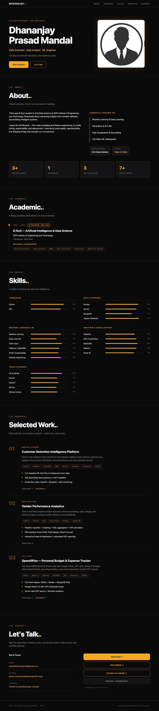

# Personal Profile Website

This project is a modern, responsive personal profile website created to showcase my academic journey, technical skills, and selected data science projects using HTML and CSS.

This portfolio was developed for:

EX.NO: 01 — Develop a Personal Profile Website using HTML and CSS.

## Preview



## About the Project

This is a modern, responsive personal profile website developed using HTML5 and CSS3. It presents a professional overview of Dhananjay Prasad Mandal, highlighting his academic background, technical capabilities, project experience, and ways to connect.

The site showcases:

- Personal introduction
- Academic background
- Skills
- Projects
- Contact information

## Features

- Modern dark-themed interface
- Responsive design
- Semantic HTML5 structure
- Smooth scrolling navigation
- Hover effects and transition styling
- Project cards with structured content
- Skills section with proficiency indicators
- Academic section with coursework details
- Contact section with social links
- Mobile-friendly layout

## Technologies Used

- HTML5
- CSS3
- CSS Grid
- Flexbox
- CSS Transitions

## Website Sections

The portfolio includes the following main sections:

1. Home
2. About
3. Academic
4. Skills
5. Projects
6. Contact

## Projects

### Customer Retention Intelligence Platform
A machine-learning-based customer churn prediction and retention project focused on analyzing churn risk, explaining drivers, and recommending actions.

### Vendor Performance Analytics
A data analytics project that evaluates vendor efficiency, sales, inventory, and profitability using structured data workflows.

### SpendWise — Personal Budget & Expense Tracker
A full-stack personal finance application for tracking expenses, budgets, analytics, and financial insights.

## Getting Started

To run this project locally:

```bash
git clone https://github.com/mandaldhananjay248-beep/Exp-1-personal-profile-website.git
cd Exp-1-personal-profile-website
```

Then open `index.html` in the browser or use VS Code Live Server for a smoother preview.

## Project Structure

```text
Exp-1-personal-profile-website/
│
├── index.html
├── style.css
├── images/
│   └── profile.jpg
├── screenshots/
│   └── website-preview.png
├── .gitignore
├── README.md
└── .git/
```

## Learning Outcome

This project demonstrates:

- HTML5 semantic structure
- CSS styling and layout design
- Responsive web design
- CSS transitions and hover effects
- Navigation and page structure
- Portfolio presentation for a student developer

## Author

Dhananjay Prasad Mandal

B.Tech — Artificial Intelligence and Data Science
Github repo : https://github.com/mandaldhananjay248-beep/Exp-1-personal-profile-website
## License

This project was created for academic and learning purposes.
